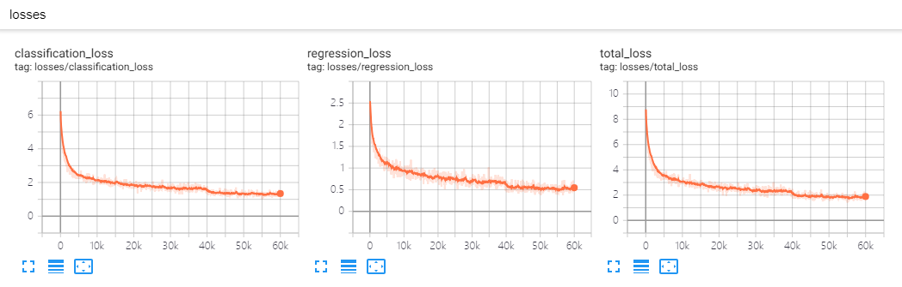
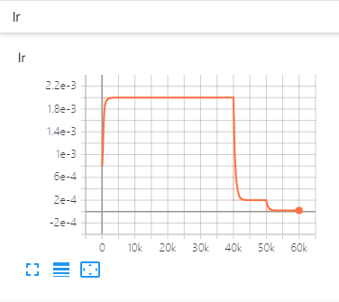
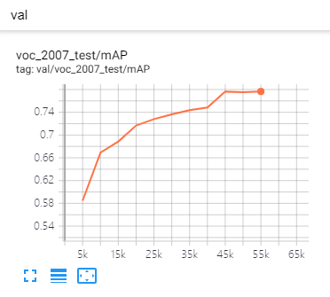

# High quality, fast, modular reference implementation of SSD in PyTorch 1.0


This repository implements [SSD (Single Shot MultiBox Detector)](https://arxiv.org/abs/1512.02325). The implementation is heavily influenced by the projects [ssd.pytorch](https://github.com/amdegroot/ssd.pytorch), [pytorch-ssd](https://github.com/qfgaohao/pytorch-ssd) and [maskrcnn-benchmark](https://github.com/facebookresearch/maskrcnn-benchmark). This repository aims to be the code base for researches based on SSD.

<div align="center">
  
  <p>Example SSD output (vgg_ssd300_voc0712).</p>
</div>

| Losses        | Learning rate | Metrics |
| :-----------: |:-------------:| :------:|
|  |  |  |

## Highlights

- **PyTorch 1.0**: Support PyTorch 1.0 or higher.
- **Multi-GPU training and inference**: We use `DistributedDataParallel`, you can train or test with arbitrary GPU(s), the training schema will change accordingly.
- **Modular**: Add your own modules without pain. We abstract `backbone`,`Detector`, `BoxHead`, `BoxPredictor`, etc. You can replace every component with your own code without change the code base. For example, You can add [EfficientNet](https://github.com/lukemelas/EfficientNet-PyTorch) as backbone, just add `efficient_net.py` (ALREADY ADDED) and register it, specific it in the config file, It's done!
- **CPU support for inference**: runs on CPU in inference time.
- **Smooth and enjoyable training procedure**: we save the state of model, optimizer, scheduler, training iter, you can stop your training and resume training exactly from the save point without change your training `CMD`.
- **Batched inference**: can perform inference using multiple images per batch per GPU.
- **Evaluating during training**: eval you model every `eval_step` to check performance improving or not.
- **Metrics Visualization**: visualize metrics details in tensorboard, like AP, APl, APm and APs for COCO dataset or mAP and 20 categories' AP for VOC dataset.
- **Auto download**: load pre-trained weights from URL and cache it.
## Installation
### Requirements

1. Python3
1. PyTorch 1.0 or higher
1. yacs
1. [Vizer](https://github.com/lufficc/Vizer)
1. GCC >= 4.9
1. OpenCV


### Step-by-step installation

```bash
git clone https://github.com/lufficc/SSD.git
cd SSD
# Required packages: torch torchvision yacs tqdm opencv-python vizer
pip install -r requirements.txt

# Done! That's ALL! No BUILD! No bothering SETUP!

# It's recommended to install the latest release of torch and torchvision.
```


## Train

### Setting Up Datasets
#### Pascal VOC

For Pascal VOC dataset, make the folder structure like this:
```
VOC_ROOT
|__ VOC2007
    |_ JPEGImages
    |_ Annotations
    |_ ImageSets
    |_ SegmentationClass
|__ VOC2012
    |_ JPEGImages
    |_ Annotations
    |_ ImageSets
    |_ SegmentationClass
|__ ...
```
Where `VOC_ROOT` default is `datasets` folder in current project, you can create symlinks to `datasets` or `export VOC_ROOT="/path/to/voc_root"`.

#### COCO

For COCO dataset, make the folder structure like this:
```
COCO_ROOT
|__ annotations
    |_ instances_valminusminival2014.json
    |_ instances_minival2014.json
    |_ instances_train2014.json
    |_ instances_val2014.json
    |_ ...
|__ train2014
    |_ <im-1-name>.jpg
    |_ ...
    |_ <im-N-name>.jpg
|__ val2014
    |_ <im-1-name>.jpg
    |_ ...
    |_ <im-N-name>.jpg
|__ ...
```
Where `COCO_ROOT` default is `datasets` folder in current project, you can create symlinks to `datasets` or `export COCO_ROOT="/path/to/coco_root"`.

### Single GPU training

```bash
# for example, train SSD300:
python train.py --config-file configs/vgg_ssd300_voc0712.yaml
```
### Multi-GPU training

```bash
# for example, train SSD300 with 4 GPUs:
export NGPUS=4
python -m torch.distributed.launch --nproc_per_node=$NGPUS train.py --config-file configs/vgg_ssd300_voc0712.yaml SOLVER.WARMUP_FACTOR 0.03333 SOLVER.WARMUP_ITERS 1000
```
The configuration files that I provide assume that we are running on single GPU. When changing number of GPUs, hyper-parameter (lr, max_iter, ...) will also changed according to this paper: [Accurate, Large Minibatch SGD: Training ImageNet in 1 Hour](https://arxiv.org/abs/1706.02677).

## Evaluate

### Single GPU evaluating

```bash
# for example, evaluate SSD300:
python test.py --config-file configs/vgg_ssd300_voc0712.yaml
```

### Multi-GPU evaluating

```bash
# for example, evaluate SSD300 with 4 GPUs:
export NGPUS=4
python -m torch.distributed.launch --nproc_per_node=$NGPUS test.py --config-file configs/vgg_ssd300_voc0712.yaml
```

## Demo

Predicting image in a folder is simple:
```bash
python demo.py --config-file configs/vgg_ssd300_voc0712.yaml --images_dir demo --ckpt https://github.com/lufficc/SSD/releases/download/1.2/vgg_ssd300_voc0712.pth
```
Then it will download and cache `vgg_ssd300_voc0712.pth` automatically and predicted images with boxes, scores and label names will saved to `demo/result` folder by default.

You will see a similar output:
```text
(0001/0005) 004101.jpg: objects 01 | load 010ms | inference 033ms | FPS 31
(0002/0005) 003123.jpg: objects 05 | load 009ms | inference 019ms | FPS 53
(0003/0005) 000342.jpg: objects 02 | load 009ms | inference 019ms | FPS 51
(0004/0005) 008591.jpg: objects 02 | load 008ms | inference 020ms | FPS 50
(0005/0005) 000542.jpg: objects 01 | load 011ms | inference 019ms | FPS 53
```

## MODEL ZOO
### Origin Paper:

|         | VOC2007 test | coco test-dev2015 |
| :-----: | :----------: |   :----------:    |
| SSD300* |     77.2     |      25.1         |
| SSD512* |     79.8     |      28.8         |

### COCO:

| Backbone       | Input Size  |          box AP                  | Model Size |  Download |
| :------------: | :----------:|   :--------------------------:   | :--------: | :-------: |
|  VGG16         |     300     |          25.2                    |  262MB     | [model](https://github.com/lufficc/SSD/releases/download/1.2/vgg_ssd300_coco_trainval35k.pth)   |
|  VGG16         |     512     |          29.0                    |  275MB     | [model](https://github.com/lufficc/SSD/releases/download/1.2/vgg_ssd512_coco_trainval35k.pth)   |

### PASCAL VOC:

| Backbone         | Input Size  |          mAP                     | Model Size | Download  |
| :--------------: | :----------:|   :--------------------------:   | :--------: | :-------: |
|  VGG16           |     300     |          77.7                    |   201MB    | [model](https://github.com/lufficc/SSD/releases/download/1.2/vgg_ssd300_voc0712.pth)  |
|  VGG16           |     512     |          80.7                    |   207MB    | [model](https://github.com/lufficc/SSD/releases/download/1.2/vgg_ssd512_voc0712.pth)  |
|  Mobilenet V2    |     320     |          68.9                    |   25.5MB   | [model](https://github.com/lufficc/SSD/releases/download/1.2/mobilenet_v2_ssd320_voc0712_v2.pth) |
|  Mobilenet V3    |     320     |          69.5                    |   29.9MB   | [model](https://github.com/lufficc/SSD/releases/download/1.2/mobilenet_v3_ssd320_voc0712.pth) |
|  EfficientNet-B3 |     300     |          73.9                    |   97.1MB   | [model](https://github.com/lufficc/SSD/releases/download/1.2/efficient_net_b3_ssd300_voc0712.pth) |

## Develop Guide

If you want to add your custom components, please see [DEVELOP_GUIDE.md](DEVELOP_GUIDE.md) for more details.


## Troubleshooting
If you have issues running or compiling this code, we have compiled a list of common issues in [TROUBLESHOOTING.md](TROUBLESHOOTING.md). If your issue is not present there, please feel free to open a new issue.

## Citations
If you use this project in your research, please cite this project.
```text
@misc{lufficc2018ssd,
    author = {Congcong Li},
    title = {{High quality, fast, modular reference implementation of SSD in PyTorch}},
    year = {2018},
    howpublished = {\url{https://github.com/lufficc/SSD}}
}
```