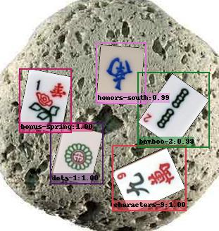
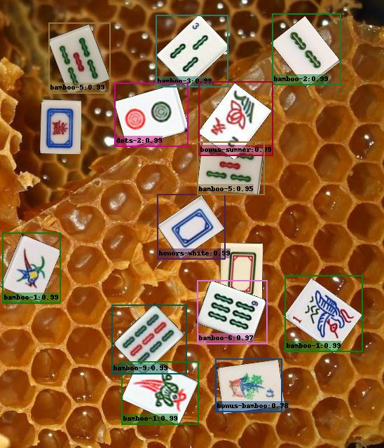

# Mahjong Object Detection -- by pytorch SSD





## Installation

```
git clone https://github.com.cnpmjs.org/lee-plus-plus/Mahjong-SSD
cd Mahjong-SSD
pip install -r requirements.txt
```

## Configuration

使用`configs/mobilenet_v2_ssd320_mahjong.yaml`配置进行训练。

麻将牌数据集置于`datasets/Mahjong`下，采用VOC2007数据集格式。可以使用[lee-plus-plus
/
mahjong-dataset-augmentation][https://github.com/lee-plus-plus/mahjong-dataset-augmentation] 自动生成。

```
Mahjong
    ├── Annotations
    |       ├── 000001.xml
    |       ├── 000002.xml
    |       │    ...
    |       └── 012000.xml
    ├── ImageSets
    │       ├── Layout
    │       │     ├── test.txt
    │       │     ├── train.txt
    │       │     ├── trainval.txt
    │       │     └── val.txt
    │       └── Main
    │             ├── test.txt
    │             ├── train.txt
    │             ├── trainval.txt
    │             └── val.txt
    └── JPEGImages
            ├── 000001.jpg
            ├── 000002.jpg
            │    ...
            └── 012000.jpg

```

`configs/mobilenet_v2_ssd320_mahjong.yaml`: `DATASETS`指定了所用的数据集名称，该名称指向`ssd/config/path_catlog.py`中的详细信息，需要将数据集按照相应要求进行配置。

`ssd/config/defaults.py`也是配置文件，优先级低于`yaml`。

[https://github.com/lee-plus-plus/mahjong-dataset-augmentation]: https://github.com/lee-plus-plus/mahjong-dataset-augmentation
